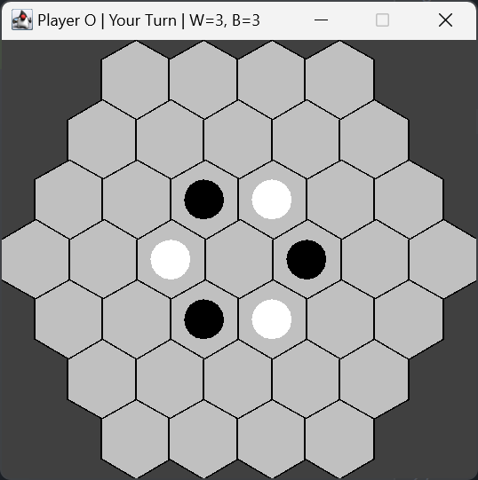
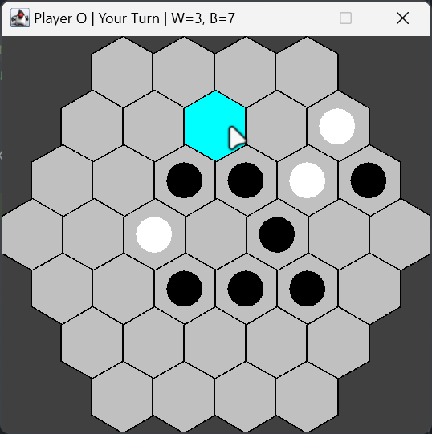
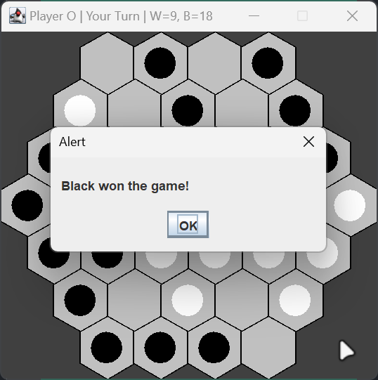

# Hexagonal Reversi

---
Per course guidelines for CS-3500: Object-Oriented Design at Northeastern University,
source code for this project must remain private. The source code will be made publicly
available upon request to [petrillo.b@northeastern.edu](mailto:petrillo.b@northeastern.edu).
---

## Project Outline
1. Description
2. Technology Stack
3. Installation and Running
4. Program Usage
5. Features & Design Patterns
6. Screenshots

### Description

Hexagonal Reversi is a twist on the traditional Orthello game, featuring a hexagonal 
grid instead of the classic square board. This variation introduces new strategic 
complexities as players must now consider six directions of play, rather than four. 
The game is played with two sets of colored discs, typically black and white, and 
the objective remains to have the majority of your discs on the board by the end of 
the game.

Players take turns placing their discs on the board, aiming to capture their 
opponent's discs. A capture occurs when a player's disc brackets one or more of 
the opponent's discs in a straight line, in any of the six possible directions. 
The bracketed discs are then flipped to the capturing player's color. The game 
continues until the board is filled or no valid moves remain for either player. 
The player with the most discs of their color on the board at the end of the game 
wins. The hexagonal layout adds a fresh layer of depth and strategy, requiring 
players to think more expansively and adapt to the increased number of potential 
moves and captures.

### Technology Stack

- Language: Java
- Frameworks: Swing (GUI), JUnit (Testing)
- IDE: IntelliJ IDEA Ultimate
- Version Control: Git
- Documentation: Javadoc, Markdown

No external libraries were used in the development of this project.

### Installation and Running

1. Clone the repository to your machine, or download the `jar` file.
2. Open the project in IntelliJ IDEA or your preferred IDE.
3. Build the `jar` manually, or navigate to the `jar` file's directory and run the following command:

```shell
java -jar HexagonalReversi.jar <board-size> <player1-type> <player2-type>
```

- `<board-size>`: The size of the board, which must be at least 5 and odd. The board size is defined
as the diameter of the game board, i.e. the number of hexagons along the longest horizontal axis.
- `<player1-type>`: The type of player for player 1.
- `<player2-type>`: The type of player for player 2.

Note: a player type is one of:
- `human`: a human player who will physically click on the board to make a move.
- `easyai`: an easy AI player.
- `hardai`: a hard AI player.
- `providerai`: an AI player based on our provider's strategy. See the [Design Patterns](#design-patterns) section for more information.

### Program Usage

Keyboard Inputs
- `enter/return`: make a move at the currently selected cell.
- `p`: pass the turn to the next player.
- `q`: quit the game.

Mouse Inputs:
- Click on a cell to highlight and select a cell. You can only select empty cells.
- Once a cell is selected, you can press `enter/return` to make a move at that cell.

### Features & Design Patterns

#### Graphical User Interface

- **Hexagonal Grid:** the game board is displayed using a hexagonal grid to process coordinates
and calculate move validity in six directions.

- **Cell Selection:** players can select cells by clicking on them, which highlights the cell
and allows them to make a move.

#### AI Players

- **Easy AI:** a simple AI player that makes novice moves by making a move at the position that flips the most cells.
- **Hard AI:** a more advanced AI player that a combination of many strategies and fallbacks, including prioritization
of corner cells, avoiding cells next to corners, and flipping the most cells.
- **Provider AI:** an AI player based on our provider's strategy, which flips the most cells.

#### Textual View

We support the option to view a textual representation of the current game state.
This can be done in the `Main.java` file like so:

```java
public static void main(String[] args) {
  // Create the Hexagonal Reversi model.
  ReversiModel model = new HexagonalReversi();
  // Initialize the textual view component.
  ReversiTextualView view = new TextualReversi(model);
  // Run various moves and print the view after each move.
  System.out.println(view);
  model.playMove(1, 0);
  System.out.println(view);
  model.playMove(0, 1);
  System.out.println(view);
}
```

#### Design Patterns

- **Model-View-Controller (MVC):** the entire project is structured using the model-view-controller
design pattern. The model represents the game state and logic, the view represents the graphical
components, and the controller handles user input and updates the model and view accordingly.
- **Strategy Pattern:** we used the strategy pattern to implement different AI player strategies.
We created a `StrategyWithFallbacks` that encapsulates the different strategies and falls back to 
another one if the current strategy fails to find a valid move (per the strategy's rules).
- **Observer Pattern:** we used the observer pattern to notify the view of changes in the model.
- **Adapter Pattern:** during the last part of this assignment, we were given code from another
pair of students to integrate into our project. We used the adapter pattern to adapt their code
appropriately, as they were using a different coordinate system and their model had a different
structure from ours. We created the adaptor class based solely on the model interface we were provided with.
- **Factory Pattern:** we used the factory pattern to create different types of AI players based on
the command-line arguments provided by the user.

### Screenshots

#### Game Start (Human)


#### Cell Selected


#### Trivial In-Game (Human)


#### Invalid Move


#### Game Over


### Credits

This project was developed by [Ben Petrillo](https://benpetrillo.dev) and Hunter Pong.